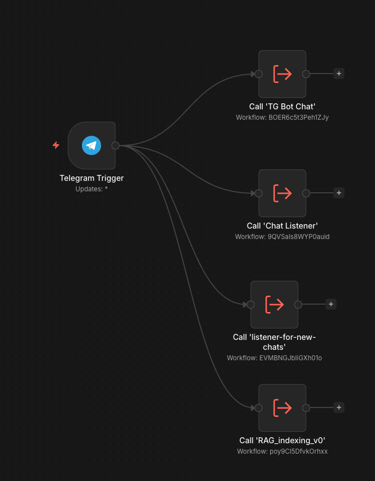
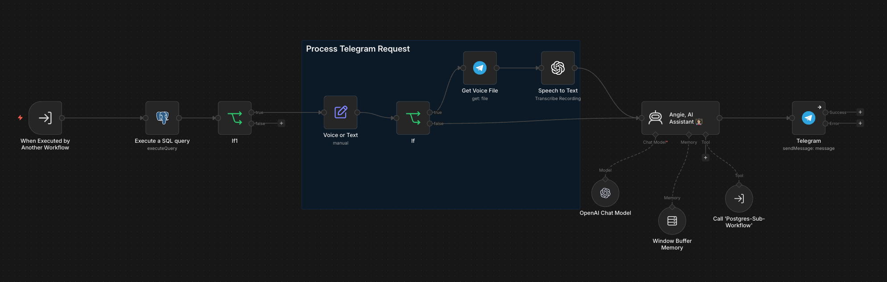
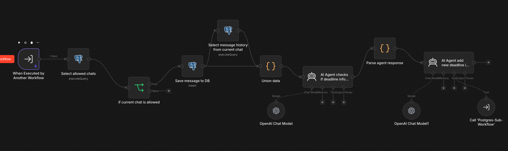
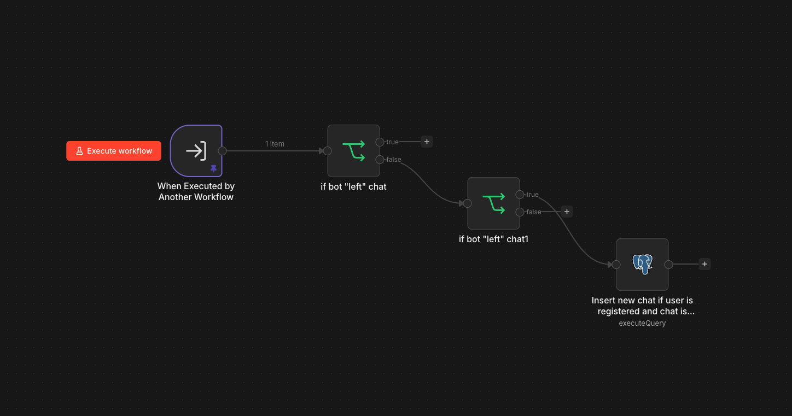
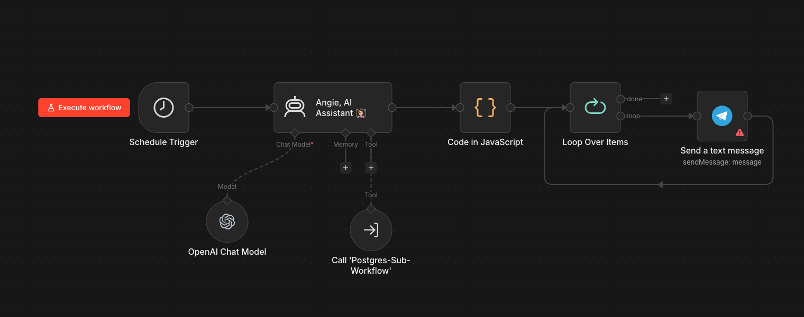
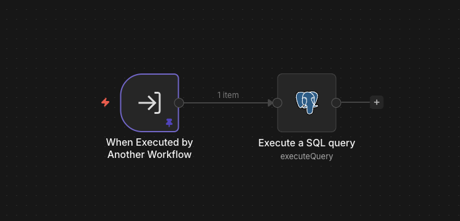

# Демонстрация воркфлоу из n8n

## Точка входа — TG Triggers

Единый Telegram Trigger (Updates: \*) раздаёт каждое входящее сообщение параллельно в 4 под-воркфлоу:

| Sub-workflow | Назначение |
|---|---|
| TG Bot Chat | Личный чат с ботом (AI ассистент) |
| Chat Listener | Мониторинг групп, извлечение дедлайнов |
| Listener for new chats | Регистрация новых чатов в `available_chats` |
| RAG indexing | Индексация файлов для векторного поиска |

---

## TG Bot Chat — личный AI ассистент

Обрабатывает личные сообщения пользователя:
- Проверяет пользователя в БД
- Если голосовое сообщение → Get Voice File → Speech to Text (транскрипция)
- Передаёт текст в **Angie AI Assistant** (OpenAI + Window Buffer Memory для истории диалога)
- Агент имеет доступ к БД через Postgres-Sub-Workflow как Tool
- Отвечает пользователю в Telegram

---

## Chat Listener — извлечение дедлайнов из групп

Мониторинг групповых чатов на наличие дедлайнов:
1. Проверяет чат по таблице `chat_subscriptions` — обрабатывает только подписанные чаты
2. Сохраняет сообщение в `chat_messages`
3. Подгружает историю чата для контекста
4. **AI Agent** анализирует текст: есть ли информация о дедлайне?
5. Если да — второй AI Agent создаёт запись в `deadlines` через Postgres-Sub-Workflow

---

## Listener for new chats — регистрация чатов

Автоматически добавляет чаты в `available_chats`:
- Фильтрует события выхода бота из чата
- INSERT в `available_chats` если отправитель зарегистрирован в `users` и чат ещё не добавлен

---

## Reminder Workflow — напоминания о дедлайнах

Периодическая рассылка напоминаний:
- Запускается по расписанию (Schedule Trigger)
- **Angie AI Assistant** через Postgres-Sub-Workflow находит ближайшие активные дедлайны
- Code in JavaScript формирует сообщения
- Loop Over Items → рассылает напоминания пользователям в Telegram

---

## Postgres Sub-Workflow — общий инструмент для SQL

Переиспользуемый под-воркфлоу: принимает SQL-запрос и выполняет его в PostgreSQL. Используется как Tool в AI агентах — позволяет агентам читать и писать данные в БД.

---

## Sub RAG_indexing — индексация файлов

Индексация документов для RAG:
- Получает файл из Telegram
- Extract from File (PDF и др.)
- Code in JavaScript — чанкинг текста
- **Postgres PGVector Store** — сохраняет эмбеддинги через OpenAI Embeddings
- Default Data Loader для структурирования данных

---

## Sub RAG_search — поиск по документам

Векторный поиск по проиндексированным материалам:
- AI Agent получает вопрос
- **Postgres PGVector Store** как Tool — ищет релевантные чанки по эмбеддингу вопроса (OpenAI)
- Code in JavaScript — форматирует результат поиска
